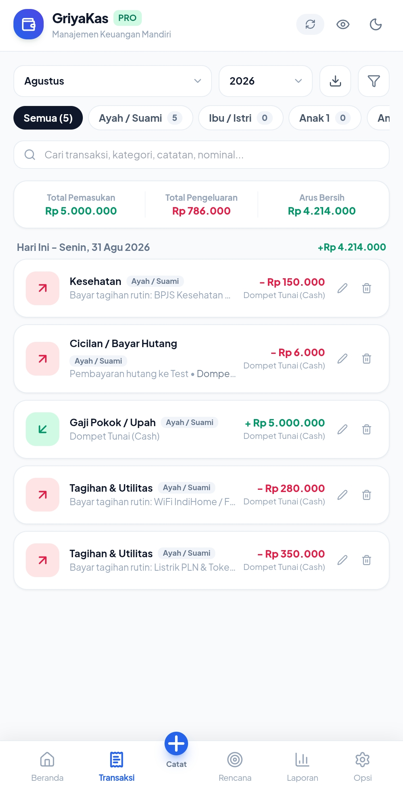

# GriyaKas

[](https://github.com/baska-pro/griya-kas/actions/workflows/ci.yml)
[](https://github.com/baska-pro/griya-kas/releases/latest)
[](LICENSE)
[](https://react.dev/)
[](https://www.typescriptlang.org/)
[](#pwa--offline)

> [English README](README.en.md)

**GriyaKas v2.0.0** adalah aplikasi manajemen keuangan keluarga dan pribadi berbasis browser dengan pendekatan **local-first**, PWA/offline, backup JSON/CSV, PIN lokal, analitik, perencanaan keuangan, serta sinkronisasi Google Sheets atau Supabase secara opsional.

## Screenshots

<p align="center">
  
  
  
  
</p>

| Tampilan | Keterangan |
| --- | --- |
| Dashboard | Ringkasan kekayaan bersih, pemasukan/pengeluaran, anggota, dan rekening/dompet. |
| Transaksi | Filter bulanan, pencarian, ringkasan arus kas, serta edit/hapus transaksi. |
| Master Data | Kelola rekening/dompet, kategori pemasukan/pengeluaran, dan anggota keluarga. |
| Catat Transaksi | Input pemasukan, pengeluaran, transfer, kategori, catatan, dan foto struk. |

Screenshot lengkap tersimpan di [`assets/screenshots/`](assets/screenshots/).

## Yang baru di v2

- Arsitektur UI modular untuk Dashboard, Transaksi, Perencanaan, Analitik, dan Pengaturan.
- Cloud Sync 2-arah berbasis ID untuk Google Apps Script dan Supabase.
- Rekening lebih lengkap, saldo awal, nomor rekening, dan nama pemilik.
- Anggaran, hutang/piutang dengan cicilan, target tabungan, dan tagihan rutin.
- Lampiran struk yang dikompresi otomatis.
- PWA dengan cache same-origin untuk penggunaan setelah aplikasi pernah dimuat.
- Migrasi otomatis data localStorage GriyaKas v1 ke skema v2.
- Backup v2 tetap menerima backup v1/format transaksi lama yang dikenali.
- PIN sekarang disimpan sebagai hash PBKDF2; PIN plaintext preview v2 dan hash PIN v1 dimigrasikan setelah verifikasi berhasil.
- Scaffolding generator lama dan import runtime eksternal yang tidak diperlukan sudah dibersihkan.

## Instalasi

Persyaratan: **Node.js 20.19+**.

```bash
git clone https://github.com/baska-pro/griya-kas.git
cd griya-kas
npm install
npm run dev
```

Validasi dan build produksi:

```bash
npm run typecheck
npm run build
npm run preview
```

## Data & migrasi v1

GriyaKas v2 membaca penyimpanan v1 satu kali dan menyalin data yang dikenali ke key v2 tanpa menghapus sumber v1 saat migrasi normal. Sebelum upgrade tetap disarankan membuat backup JSON dari v1. Detail: [docs/MIGRATION_V1_TO_V2.md](docs/MIGRATION_V1_TO_V2.md).

## Cloud Sync

Cloud Sync **opsional**. Data utama tetap berada di browser.

- **Google Sheets**: menggunakan Web App Google Apps Script dari `code.gs`.
- **Supabase**: menggunakan REST API project milik pengguna sendiri.

`anon key` Supabase adalah public client key, bukan secret. Keamanan data Supabase bergantung pada konfigurasi project dan RLS. Template bawaan ditujukan untuk project pribadi yang aksesnya Anda kendalikan; jangan memakai project database bersama/public untuk data keuangan sensitif. Detail: [docs/CLOUD_SYNC.md](docs/CLOUD_SYNC.md).

## PWA & offline

Manifest dan service worker berada di `public/`. Aset aplikasi same-origin dicache setelah penggunaan pertama. Fitur cloud tentu tetap membutuhkan jaringan.

## Privasi

- Tidak ada analytics/telemetry pihak ketiga bawaan.
- Data transaksi utama disimpan di browser kecuali pengguna mengaktifkan cloud sync.
- PIN bukan enkripsi database; PIN hanya mengunci antarmuka aplikasi pada browser tersebut.

## Fitur utama

- Pemasukan, pengeluaran, transfer antar rekening.
- Multi-rekening dan multi-anggota keluarga.
- Filter, pencarian, struk/lampiran, CSV dan laporan.
- Budget bulanan, hutang/piutang, cicilan, target tabungan, tagihan rutin.
- Analitik kategori dan anggota keluarga.
- Tema, dark mode, sembunyikan saldo, PIN.
- Backup/restore JSON dan migrasi data.
- Optional Google Sheets / Supabase sync.

## Dokumentasi

- [Instalasi](docs/INSTALLATION.md)
- [Migrasi v1 → v2](docs/MIGRATION_V1_TO_V2.md)
- [Cloud Sync](docs/CLOUD_SYNC.md)
- [Security](SECURITY.md)
- [Changelog](CHANGELOG.md)

## License

BASKA-PRO PERSONAL USE LICENSE Version 1.0. Lihat [LICENSE](LICENSE).
